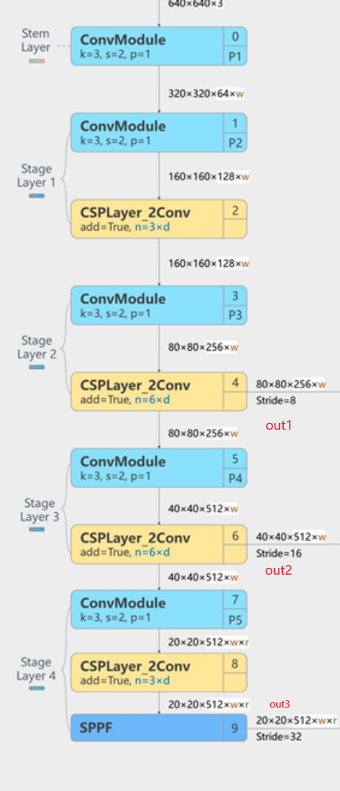
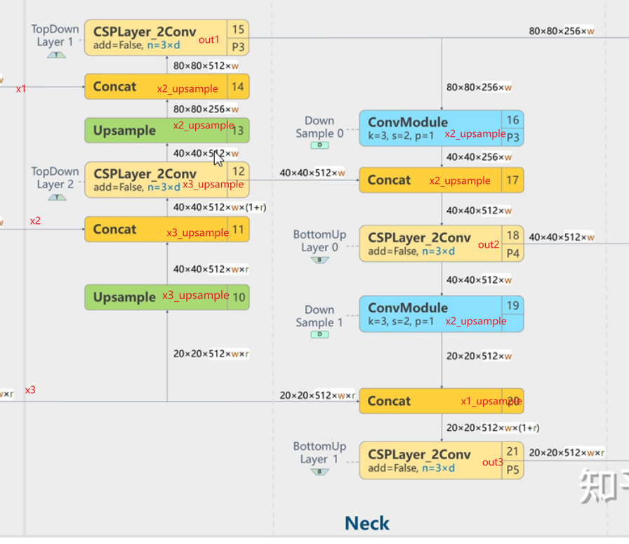

# 目标检测项目

## 2023年11月10日commit

1. config中需要更换文件路径
2. utils中写了load_image,load_csv,load_id_list,load_all等函数
3. 只需要调用load_all就可以获取所有的image数据\[channels,width,height\]的列表以及所有csv中的数据

## 网络模型选择

经过对于yolov8网络模型性能图的分析，拟采用yolov8-s的网络(或yolov8-m)

mAP在m处出现明显的拐点，使用再大的模型提升不大，速度在s处出现明显拐点，使用再大的模型提升不大，需要考虑模型的大小，可能s更适合

目前拟先进行yolov8的s模型的测试，如果有一定效果可以尝试m处的模型

## 2023年11月11日commit

初始化了netLayer中的ConvModule，SPPF，DarknetBottle，CspLayer_2Conv等基础模型

==这些模型大部分都有整除的过程，可能会出现非偶数时的舍入误差，我在旁边加了warning，如果模型运行没问题，为了提高运行效率，将删除这些warning==

## 2023年11月20日commit

### BackBone forward函数变量名称

### Neck forward函数中变量名称

